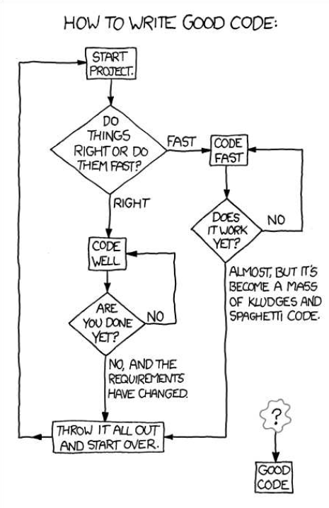

# Introduction To Software Engineering

My software never has bugs, it just develops random features.

我的软件从来没有bug，只是随机开发出一些新特性而已。

## Basic Course Goal

* Cover the basics of developing software in a professional environment. 
* Learn to be part of a development team. 

## 3 components of course

1. Methodologies - process to develop software systems. 

   方法论 - 软件系统开发过程。

2. Tools - Tools to create professional software. 

   工具 - 创建专业软件的工具。

3. Android - learn to develop applications for a new platform. 

   安卓 - 学习为新平台开发应用程序。

   

# Software Engineering

* **Software engineering** is concerned with *theories*, *methods* and *tools* for professional software development. 

* Software engineering is a <u>discipline</u> concerned with <u>all aspects</u> of software production from early specification through maintaining system while in use. 

  软件工程是一个学科，涉及从早期规范到使用过程中维护系统的软件生产的各个方面。

  * discipline - Using appropriate theories and methods to solve problems meeting business and financial constraints. 
  * all aspects - Not just writing code: indicates project management, development of tools, methods etc. to support software production. 

## Overview of Job Terminology 工作术语概述

* Programmer

  ```
  Someone who just writes code. (code monkey)
  ```

* Engineer

  ```
  In Canada, "Engineer" often refers to licensed members of the engineering profession. 
  ```

* Software Developer √

  ```
  Someone who applies software engineering methods to create realiable, well designed and maintainable software systems. 
  ```


## Importance of Software Engineering

* Society increasingly reliant on software systems. 

  * Power grid(电网), cell phone network, transportation network, Internet, Interact (debit cards借记卡), email, etc.

* How can we create reliable systems economiclly and quickly?

  * Cheaper to use *software engineering methods* vs. write the programs as if it was a *personal programming project*.
* Majority of costs is for changing software after it has gone into use. (maintenance)
  



## Software Process Activities

  * Specification
    * customer and developers define software features and constraints on its operation. 
  * Development
    * design and program the software. 
  * Validation 
    * ensure software is what customer requires. 
  * Evolution
  * modify software to reflect changing customer and market requirements. 

## Essential Attributes of Good Software

  * Maintainability
    * Change is inevitable: develop software so that it can evolve to meet changing needs of customers.(改变是不可避免的：开发软件使其可以发展以满足客户不断变化的需求)
  * Dependability and Security 可靠性和安全性
    * Must be reliable, secure, and safe: not cause physical or economic damage on failure. 
    * Malicious users unabe to access/damage system.
  * Efficiency
    * Efficient use of resources: processing time, memory.
  * Acceptability
    * Software must be acceptable by its users: 
      * understandable
      * usable
      * compatible with other systems


<a href="https://mengduanxian.github.io/SoftwareEngineering/1.SoftwareEngineeringDiversity.html">1. Software Engineering Diversity</a>

<a href="mengduanxian.github.io">弦弦の小窝</a>


