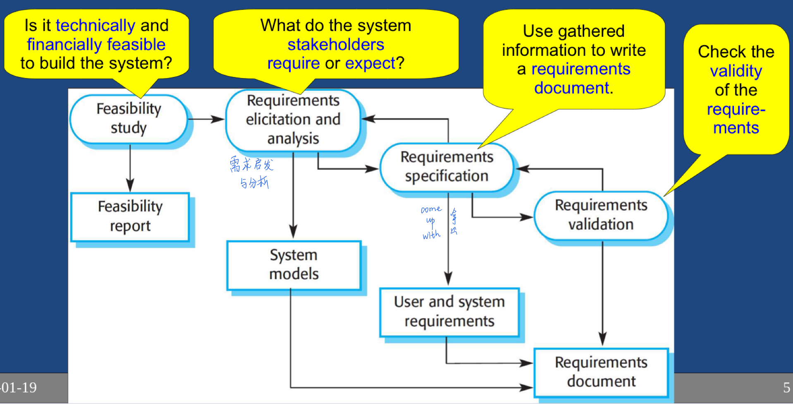

# Midterm Review

## 0-Admin

* 3 components of course
  * Methodologies - Processes to develop software systems.
  * Tools - Tools used to create professional software. 
  * Android - Learn to develop applications for a new platform. 

## 1-Intro to Software Engineering (SE)

* ##### What is Software Engineering? (memorize)

  * Software engineering is concerned with theories, methods, and tools for professional software development. 
  * It is a <u>discipline</u> concerned with <u>all aspects of software production</u> from specification  through maintaining system while in use. 
    * <u>discipline</u> - Using appropriate theories and methods to solve problems meeting business and financial constraints. 
    * <u>all aspects of software production</u> - Not just writing code: includes project management, development of tools, methods, etc. to support software production. 

* ##### Importance of software engineering (memorize)

  * More and more, individuals and society rely on advanced software systems. We need to be able to produce reliable and trustworthy systems economically and quickly. 
  * It is usually cheaper, in the long run, to use software engineering methods and techniques for software systems rather than just write the programs as if it was a personal programming project. For most types of systems, the majority of costs are the costs of changing the software after it has gone to use. 

* ##### 4 fundamental software process activities (memorize)

  * **Software Specification** 规范
    * customer and developers define software features and constraints on its operation (操作). 
  * **Software Development**
    * design and program the software. 
  * **Software Validation**
    * ensure software is what customer requires. 
  * **Software Evolution** 演化
    * modify software to reflect changing customer and market requirements. 

* ##### 4 essential attributes of good software (be able to talk about the topic/items)

  * **Maintainability**  可维护性
    * Change is inevitable(必然的): develop software so that it can evolve to meet changing needs of customers. 
  * **Dependability and Security** 可靠性和安全性
    * Must be reliable, secure, and safe: not cause physical or economic damage on failure. 
    * Malicious(恶意的) users unable to access / damage the system. 
  * **Efficiency** 
    * Efficient use of resources: processing time, memory. 
  * **Acceptability** 可接受性
    * Software must be acceptable its users: understandable, usable, and compatible with other systems. 

* ##### What's the difference of functional requirements and non-functional requirements?

  * A functional requirement describes what a software system should do, while a non-functional requirements place constraints on how the system will do so. 
  * ex of functional requirements: A system must send an email whenever a certain condition is met (e.g. an order is placed, a customer signs up, etc).
  * ex of non-functional requirements: Emails should be sent with a latency of no greater than 12 hours from such an activity.
  * The functional requirement is describing the behavior of the system as it relates to the system's functionality. 
  * The non-functional requirement elaborates a performance characteristic of the system. 

* ##### diversity of the types of software engineering (be able to talk about the topic/items)

  * **Stand-alone applications** 独立应用程序
    * include all necessary functionality;
    * do not need to be connected to a network. 
  * **Embedded** 
    * Software control systems managing hardware devices. 
    * More embedded systems than any other type of systems. 
  * **Entertainment**
    * Games primarily for personal use. 
  * **Batch processing** 批量处理
    * ex: payroll (工资单); monthly billing by a phone company. 
    * Process data in large batches. 
  * **Modelling and simulation**
    * For scientists and engineers to model complex physical process or situations. 
    * ex: car crashes, nuclear reactions, weather prediction. 
  * **Data collection**
    * Collect sensor data(传感器数据) to send to other systems for processing. 
  * **Systems of systems**
    * Combine some other software systems. 
    * Ex: Car. 
  * **Web software**
    * Reuses many system components
    * user interfaces limited by web browser. 
  * **Software as a Service**
    * Applications run remotely on the cloud. Users don't buy software but pay according to use. 
    * Ex: Google docs, Amazon Web Services, etc. 
    * Cloud 'as-a-service' types: 
      * Software as a Service (SaaS)
      * Infrastructure as a Services (IaaS)
      * Platform as a Services (Paas)

* ##### How each type of application need a different process?

  * ##### (how the applications functional and non-functional requirements)

  * ##### (How they differ in their priorities)

  * ##### Differences in lifecycles and lifetimes of the applications 

  * ##### etc

  * Diverse types of systems

    * Distributed systems operate across networks: different types of computer and mobile devices. 

  * Changing environment

    * software has to keep up with rapidly changing business and society. 
    * Must change existing software and rapidly develop new software. 

  * Security and Trust

    * software is intertwined(交织) with all aspects of our lives: it is essential that we can trust it. 
    * eg. Banking, Vehicle, government. 

* **Explain the need to be professional managed**

  * Common need: All software projects should be professionally managed and developed. 
  * Different Needs: Different types of systems require different techniques: 
    * games developed in series of playable versions. 
    * life-critical systems need a complete specification. 
    * no one method is better than others in all cases. 
  * Select software engineering methods and tools by: 
    * type of application being developed, 
    * the requirements of the customer, and 
    * the background of the development team. 

## 2-Revision Control

* ##### purpose and need for revision control

  * revision control 概念
    * a system to manage changes to electronic documents.
    * also called version control, sources control, software configuration management. 
  * purpose and need 
    * need to coordinate changes made by multiple developers. 
    * need a reliable system to ensure changes are not lost or incompatible. 

* **how Git operates in terms of the working directory, local repository, remote repository**

  * Local machine has a Git Repository (Repo)
  * The latest code in the repo can be checked-out into the working directory. 
  * Changes to files in the working directory are committed to the local repo. 
  * Remote server has a Git repo, (server accessed by multiple developers.) local repo syncs up with remote repo by clone, push and pull commands. 

* ##### Commit 

  * changes to files in the working directory are committed to the local repo. 

* ##### head

  * the latest version of the code.
  * head(小写)是commit对象的引用。每个head都有一个名字（分支名字或标签名字等等），但在默认情况下，每个叫master的repository都会有一个head， 一个repo可以包含任意数量的head。

* ##### clone

  * copy an existing repo on remote server to local computer. 

* ##### clone command

  * clone an existing repo to local PC.

* ##### status command

  * view the state of local file changes.

* ##### add command

  * stages the changes as being ready to commit. (将更改分阶段准备提交)
  * also used for adding files to Git (tracking them).

* ##### commit command

  * commit all staged changes to local repo. 
  * sometimes termed "Check-in

* ##### push command

  * Transfer locally committed changes to remote repo. 
  * if there's something new on the server, git will not allow you to push, must pull first. 

* ##### pull command

  * get changes from remote repo and apply them to local repo and working directory (move to head).
  * If there are any conflicting changes, may need to do a merge.

* ##### log command

  * at any time, can view the changes people have made. 

* ##### merge command

  * edjiawojd

* ##### distributed revision control system 分布式版本控制系统

  * git has no single centralized master repository, each "local repo" is full and complete repo. (git没有单个集中式主存储库)

  * can work off-line (on a plane) and still commit to the local repo. Later sync up with the remote repo. 

    * 引用知乎大神的解释：https://www.zhihu.com/question/20093241

      **1. 去中心化**
      这个应该就是楼主所说的分布式。Git是没有中心服务器的，每个人机器上都是一个完整的库，我们平时开发代码时的中央服务器其实和我们自己机器上的库内容是完全一样的（格式有点不同，是bare的）。虽然平时大家都是将代码提交到中央服务器上再统一pull别人的代码，但实际情况你可以总是pull张三的库，然后push给李四等等操作。
      个人认为去中心化是Git（也包括其他分布式VCS）最伟大的改变。去中心化意味着没有权威、没有主力，所有人都是平等的。这概念本身看起来好像没什么，但实际对社区影响是巨大的，去看看 [http://github.com](https://link.zhihu.com/?target=http%3A//github.com) 上的fork功能，你可以fork任何一个你喜欢的项目，接着按自己的喜好修改成自己的项目，或是发起pull request请原作者merge你的功能到他们项目里去（这同样也得益于Git另一项与SVN很大不同的功能——分支策略），而且大多数开源项目都会鼓励你去fork它们。这里面没有权威，没有主从，所有人只要有兴趣都可以在其他人的基础上去构建更强大或是更有领域针对性的项目。大家不是为了开发某个项目而来，而是为了贡献更强的功能给社区，这样最终的项目将是整个社区所有人共同努力的结果，将生生世世繁衍不息。
      当然，去中心化也可能会引发一些问题，比如Linux的各种发行版本有时候让人难以抉择，但相信市场之手会帮我们做出选择。

      **2. 本地提交**
      本地提交好处主要有3点：
      1) 断网提交
      2) 小步提交。可以对自己的阶段成果有跟踪，并且提高每次变更的安全性
      3) 本地库。这个和断网提交是同一个实现，但从需求角度出发则略有不同，主要是说即使只有自己一个人开发项目，也可以轻易的让自己的代码有版本跟踪，而不需要去费力建个什么svn server
      4) 本地回滚。这个其实是由于本地库的存在而产生的，但可以减少中央库上的冗余版本

      **3. 分支策略**
      分支策略从技术上来讲是将版本节点化了，即最终的版本状态是树状的。从结果上来讲既是弱化了分支，也是强化了分支。弱化的是分支的概念，强化的是分支的功能。
      在Git实际开发中分支的分离和merge是属于日常操作，开启和合并分支成本相比SVN要小得多：SVN是复制一份代码到分支目录，Git则是在分支点做一下标记。随便一次冲突就会自动产生分支，所以大家每天都在与分支打交道。这便是弱化了分支的概念，由于分支成本很小，因此使得按功能分支的开发模式（每个分支一个功能，开发完了再merge到主干）变得非常简单，大家可以完全不需要再因为担心SCM成本太高而选用主干开发模式（所有功能都在主干上开发，到了发版本前再分离出分支）。

      当然Git还有很多其他不错的地方，比如Tag策略（和分支策略一样，做个标记，不像SVN要复制一份过去），下载时会压缩以加快速度，各类提示非常到位

* ##### how GitLab fits in?

  * GitLab is a dedicated Git server add extra team collaboration and discussion tools. 

* ##### basic git sequence for editing code (without a branch)

  * [create repo on csil-git1.cs.surrey.sfu.ca]
  * git clone \<git@csil-git1.cs...>
  * [editing the file]
  * git status 
    * what currently change on local system.
  * git add 文件名
  * git commit -m "message" OR git commit 打开view, :wq退出vim
    * 只是提交到本地，并没有提交到server
  * git pull
  * git push 
    * 提交到server (don't do force on group project)
  * git log 
  * git pull OR git pull origin master [拉取远程服务器origin的master分支]

* ##### how to merge conflicts in a .java file with Android Studio

  * VCS → Update Project → ok
  * 跳出一个对话框: Conflicts → Merge
  * It shows yours (left) & your teammates (right) code. 中间是base version.
  * 改完以后点击apply
  * Commit时，弹出窗口中右键点击不能（或不需要）
  * commit的文件，选择ignore

* ##### what .gitignore is for？

  * Lists file types to exclude from Git: Ensures only the right kind of files are added. 

* ##### what is a tag?

  * Mark certain versions of certain files as a group. 
    * ex: "Files for Version 1.0 of produce".
  * Able to easily checkout these exact version of the files later to fix bugs etc. 

* ##### Good commit message

  * Line 1: Short summary (<70 characters)
    * Capitalize your statement
    * Use imperative: "Fix bug ..." vs "fixed" or "fixes"
  * Line 2: Blank
  * Line 3: Details; wrap your text ~70 characters. 
  * If pair programming, add pair's user ID at start: "[pair: Xianxian] Make game state persist ..."

* ##### how to revert changes in a file with Git? 还原

  * 'git checkout' to revert files
    * Discards any uncommitted changes to a file. 
    * Overwrite file in working directory with one from local repo. 
  * Revert with Caution
    * will lose all uncommitted changes in the file. 
    * normally Git does not let you lose changes. 
    * if in doubt, grab a backup copy (ZIP your folder) then revert. 

* ##### lock-edit-unlock and/vs checkout-edit-merge

  * Lock-Edit-Unlock
    * Locking prevents merge conflicts by preventing others from changing the file. 
    * Adds pressure to make changes quickly error prone. 
  * Checkout-Edit-Merge
    * Merge support allows concurrent access to a file so multiple developers can work on same code at once. 
    * But can lead to merge conflicts. 

* ##### atomic operations 自动操作

  * No part of a change occurs unless the whole change does. 
  * Change is applied all at once: no other changes applied while you're checking in.

* ##### Minimum requirement to committing code

  * Don't break the build!
  * When you check in, the full system must compile and run. 
  * Only under exceptional circumstances should you ever check in something which breaks the build. 

* ##### Expected commit frequency

  * Commit little changes to local repo very often (~hourly).
  * Once some work is more stable, push all the changes at once to remote repo (~daily).

* ##### the three points about how coding with source control is different, and why?

  * Don't write journals in comments in source code. 
    * Make the file size as small as possible. 
  * Don't leave dead code. 
    * Leaving dead code in is an obstacle to programmer understanding and action. 
    * There's the risk that the code is awakened which can cause significant problems. 
  * Don't sign your code.
    * Nobody care who wrote this code. 

## 3-Testing

* ##### white box vs. black box testing; (able to discuss benefits of each)

  * White Box Testing
    * can see source code when writing tests. 
    * also called clear box or glass box.
    * benefit: knowing the code can help you make better, more complete tests.
  * Black Box Testing
    * have no access to system internals.
    * Often for user interface testing. 
    * benefit: not knowing the code can help you see the big picture and find incorrect assumptions in code. 

* ##### What is Acceptance Testing?

  * Acceptance testing tests product from customer's perspective. 
  * "Are needed features included?"
  * "Do the features work as expected?"

* ##### How to generate acceptance test?

  * Can generate acceptance tests from user's requirement. 

* ##### How Acceptance Testing be performed?

  * Acceptance tests often manually done by a tester. 
    * writing test cases and scripts based on business and functional requirements. 
    * Executing high complexity testing tasks. 
    * Recording and reporting task results. 
    * Proactively(积极地) working with project team members to improve the quality of project deliverables(可交付成果). 

* ##### Alpha and Beta testing

  * Alpha testing - users try out software at developer's site. 
  * Beta testing - software deployed for limited initial testing at customer's site. 

* ##### usual content of a bug report

  | Bug Report Component           | Description                                                  |
  | ------------------------------ | ------------------------------------------------------------ |
  | Summary                        | Concise(简洁), 1 line description of problem.                |
  | Component                      | Which product had error                                      |
  | Steps to reproduce the problem | Actions to cause error. Does it always occur, or only occasionally? Create simple example to demonstrate. |
  | Expected vs. Actual result     | What the steps should do, vs. what actually do. Ensure it is actually an error not a feature: "Working as intended"? |
  | Environment                    | Software version, OS, hardware, drivers, ...                 |
  |                                |                                                              |
  
* ##### Life-cycle of a bug

  * New -> Assign -> Resolved ->Reopened / Verified -> Closed

* ##### Possible solutions

  * Fixed
  * Duplicate
  * Won't fix
  * Cannot reproduce (无法复制)
  * Working as intended (按预期工作)
  * Enhancement / feature request (增强 / 功能需求)

* ##### What is a Unit Test? 

  * Unit tests test a class in isolation.

* ##### Unit Test Purpose?

  * For you to "know" your code works. 
  * Should test ~100% of a class. 
  * Helps improve quality of code. 
  * Supports aggressive refactoring because you can quickly check your code is correct. 

* ##### Purpose of the test runner?

  * JUnit test runner executes your test class. 

* ##### How a test runner executes tests?

  * JUnit: "Test Runner" executes all methods with @Test annotation.(测试运行程序执行带有测试注释的方法)
  * Tests are doing using JUnit's asserts

* ##### Green bar

  * all tests successful.

* ##### Red bar

  * at least one of the test cases fails.

* ##### How to write a JUnit5 test?

  * ```java
    @Test
    void testCreate(){
        Puppy rover = new Puppy("Rover", 100);
        assertEquals("Rover", rover.getName());
        int i=10;
        assertTrue(i==10);
        assertFalse(i==-5);
    }
    //throws used to test exception throwing, test fails unless it throws IllegalArgumentException.
    @Test
    void testThrows(){
        assertThrows(IllegalArgumentException.class,)
    }
    //Ignore the test so "to-be-done" style tests do not break testing.
    @Disable("DB does not yet support reconnecting.")
    
    ```

* ##### steps in Android Studio to add tests to a class and run test

  1. Create JUnit Test Class:
     1. Open class under test
     2. click class name, alt-enter -> create test
     3. select JUnit 5, click OK
     4. Select “...\app\src\test\java\folder”
  2. Execute test:
     1. Run -> Run ... (alt-shift-F10)
     2. Select your JUnit test class.
  3. Run app: Run -> Run...; select "app"

* ##### Partition testing & Equivalence partitions

  * Partition testing 
    * identify groups, or regions of values in the input and output results with should behave similar. 
  * Equivalence class / Equivalence partitions
    * program behaves in an equivalent way for each group member. 

* ##### General testing guidelines

  * Choose test inputs to 
    * generate all error messages. 
    * cause buffers to overflow; (缓存区溢出)
    * force calculation result to be too large (or small): overflow or underflow. 
    * Testing with arrays:
      * Different numbers of elements. Ex: 0, 1, 2, 100, 32000 ...
      * Put desired element first, last, middle. 

* ##### Code coverage

  * % of class under test's lines executed by tests. 
  * want ~100% code coverage: all lines of code executed at least once. 

* ##### How to check code coverage (in AS)?

  * Run -> Run PuppyTest with Coverage

* ##### Why is it important that test code be held to same quality standard as production code? (为什么将测试代码保持与生产代码相同的质量标准很重要？)

  * Unit tests are integral part software development.
  * Good code quality makes maintenance easier
    * keeps tests current and relevant
    * poor code makes tests obsolete(过时) fast (and useless)!
    * unreliable tests cause developers to lose trust. 

* ##### What to do if a routine is unusually buggy. 

  * If you find a function which is quite buggy, don't debug it, rewrite the function!

### 4-Software Processes 软件流程

* ##### What is a software process?

  * A structured set of activities required to develop a software system. 

* ##### 4 software process activities

  * **Specification** - what will the system do?
  * **Design & implementation** - how will it do this? Actually make it work.
  * **Validation** - does it do what the customer wants?
  * **Evolution** - change system to meet customer's changing needs. 

* ##### steps in the "Software Specification" overview

  * **software specification** establish what services are required and constraints on the system's operation and development. 

    

* ##### The basic process to get from system specification to an executable system.

  * system specification --(software design)-> software structure --(implementation)-> executable system

* ##### different design activities

  * architectural design - identify overall structure of the system & principle components: sub-systems or modules.
  * UI design - layout initial ideas for user interface (UI).
  * component design - design each system component
  * database design - design the system's data structures and database

* 3 testing stages

  * component testing(组件测试) - individual functions or objects are tested independently. May test coherent groupings of objections. 
  * system testing (系统测试) - Testing of system as a whole. Testing of emergent properties is particularly important. 
  * Acceptance testing (认可测试) - Testing with customer data to check that system meets customer's needs. 

* ##### Planning Paradigms 规划范式

  * Plan-driven processes: 
    * All process activities are planned in advance. 
    * Progress is measured against this plan. (进度是根据该计划衡量的)
    * also called Big Design Up Front (BDUF). (预先做大量的设计)
  * Agile processes: 
    * Planning is incremental
    * Easier to change the process to reflect changing customer requirements. 

* ##### software delivery (timing) options

  * single delivery (at end)
    * software only delivered to customer once it;s fully completed. 
  * incremental delivery
    * customer is given incomplete versions of the software throughout development. 

* ##### waterfall model

  * Plan-driven model - separate and distinct phases of specification and development. 

* ##### waterfall model phases

  * requirements difinetion
  * system and software design
  * implementation and unit testing 
  * integration and system testing 
  * operation and maintenance

* ##### waterfall model's ability to cope with change.

  * inflexible stages make it difficult to meet changing customer requirements. 
  * must complete phase N before starting phase N+1.
  * waterfall model is (somewhat) appropriate when requirements are well-understood and change is limited. 
  * Plan-driven nature of the waterfall model helps coordinate the work. However, waterfall is so rigid it is virtually never used as a full methodology.

* ##### incremental development

  * specification, development and validation are interleaved. 

* ##### how incremental development can be used by either paradigm?

  * Plan driven models - functionality of increments are planned in advance. 
  * agile models - functionality of early increments are planned, later increments are driven by customer's needs. 

* ##### benefits of incremental development

  * reduced cost from changing customer requirements - not as much code (plan?) written that must change. 
  * Quick delivery of useful software.
    * easier to get customer feedback on working software rather than paper designs. 
    * customer uses and gains value from the software earlier than with a single end delivery process. 

* ##### drawback to incremental development

  * code rot 代码腐烂
    * regular change tends to corrupt system's structure. (定期更改往往会破坏结构)
    * incorporating code changes becomes increasingly difficult and costly. 
    * time and money must be spent refactoring to improve the software. 

* ##### refactoring

  * refactoring improves the code without adding new feature. 
  * ex:
    * rename a poorly named variable
    * split huge function into smaller ones
    * improve OOD (object oriented design)
    * fixing parts of the code which have poor code quality or poor readability.

### 5-Change risk

* ##### why change is inevitable?

  * change is inevitable in all large software projects:
    * business changes lead to new (or changed) system requirements. 
    * new technologies oped up new possibilities. 

* ##### cost of change

  * cost of change = cost of reworking completed work (re-analyzing requirements, design, recoding) + cost of implementing new functionality.

* ##### change avoidance 避免变更

  * software development process include activities to anticipate(预料) possible changes before significant rework is required. 
  * waterfall
* ex: develop a prototype system to show a key (uncertain?) feature to customers. 
  
* ##### change tolerance 改变容忍度

  * software development process is designed to accommodate changes at lower cost. 软件开发过程旨在以较低的成本适应变化。
  * usually incremental development
  * changes may be in a future increment (no rework), or may have to alter part of the existing system. 

* #### Throwaway software prototyping 一次性软件原型

* ##### When and how it is used?

  * A test implementation of the system used to try out options. 用于试用选项的系统的测试实现。

* ##### What can be ignored?

  * prototypes could ignore things like code quality, error-handling, or testability. 

* ##### Why is it a throwaway?

  * Throwaway code not a basis for the system. 
  * built to answer a specific question, not to see if the whole system will work.

* ##### How it avoids change?

  * prototypes leave out some functionality

    * focus on poorly understood areas of the product; 

    * error checking and recovery may be omitted. 

    * focus on functional rather than non-functional requirements. 

      (functional: accessing hardware, screen layouts, database access.)

      (non-functional: security, performance, etc.)

* ##### The ways Throwaway software prototyping improves a system

  * improved system usability.
  * a closer match to users' real needs.
  * improved design quality.
  * improved maintainability. 
  * reduced development effort. 

#### Incremental delivery

* ##### When and how it is used?
  * Development and delivery are broken down into increments: each increment delivers some required functionality. 
  * Prioritized user requirements - highest priority ones included in early increments. 
  * Requirement changes
    * once the development of an increment is started, the requirements are frozen. 
    * requirements for later increments continue to evolve. 

* ##### use of incremental development

  * develop the system in increments. 
  * customer evaluates incremental before proceeding to development of next increment; 
  * Normal approach used in agile methods.

* ##### benefits of incremental development

  * new functionality delivered with each increment so system functionality is available earlier. 
  * early increments act like a prototype to help elicit(引出) requirements for later increments.
  * lower risk of overall project failure. 
  * highest priority requirements implemented first and receive the most testing. 

* ##### incremental delivery

  * deploy an increment for use by end-users;
  * more realistic evaluation because of practical use; 
  * difficult to implement for replacement systems as increments have less functionality than old system.

* ##### incremental delivery cycle

  * start -> plan the increment -> develop the increment -> validate the increment -> deploy the increment -> final system delivered.

* ##### incremental delivery problems

  * common functionality
    * most systems require a set of basic facilities that are used by different parts of the system.
    * hard to identify common facilities because requirements are not defined in detail until an increment is to be implemented. 
  * contracts
    * specification developed iteratively with the software. 
    * complete system specification can be needed as part of the system development contract.

### 6-Scrum - an Agile Process

* ##### 4 changes listed between Agile and BDUF. 

  * Document as you go; only as needed
  * Deliver product early and often
  * Plan as you go: not just at the start of the project
  * Test as you go: not just at the end of project

* ##### backlog / user stories - list of feature requests.

  * highest priority features ("stories") at top of backlog. 
  * team picks stories to complete from top of backlog.

* ##### iteration - a week (or 2-3) where team commits to deliver some user stories. 

  * At end of iteration, team delivers working software. 
  * customer then tries out software & gives feedback
  * use feedback to plan next iteration.

* ##### Product Owner 

  * (may not write code, but look what product should do)
  * Keeper of product vision.
    * understands needs of the customer
    * works closely with the stakeholders to determine what needs to be built, and feature priorities. 
  * Manages backlog 管理积压
    * adds new feature requests
    * prioritizes features: directs the team towards most valued work.
  * Responsibility: to maximize value to the business. 

* ##### Scrum Master

  * The coach
    * guides team towards more cohesion, self-organizing,performance
    * scrum master's deliverable is the self-organizing team. 
  * Not the boss, is a trusted advisor, and team-advocate
    * pushes decision making back to team
    * removes impediments(障碍) (ex: getting equipment)
    * expert on scrum process; facilitates meetings. 
  * Responsibility: a well functioning agile team. 

* ##### Team Member

  * Teams are collaborative, self-organizing
    * have total authority over how to get work done.
    * estimates work for each feature
    * 7 +/- team members
  * Responsibility: Delivering stories that the team committed to. 
    * no singled out "experts"; everyone does what is needed for this iteration. 
    * no "silos of knowledge"(没有知识的荒岛), team members should share knowledge. 

* ##### Repository Manager

  * not part of normal Scrum; added as part of a GitLab development work-flow. 
  * accepts merge requests when they are ready. 
    * Helps resolve Git problems.
    * Helps enforce code quality. 
  * Responsibility: ensures team's process is followed to commit code. 
    * It must meet coding style; have unit tests, system pass all unit tests, code reviewed, etc.

#### Sprint Ceremonies

* ##### what is a sprint?

  * Sprint is Scrum's iterations.

* ##### Sprint Planning [2hr]

  * Team pick what stories to commit to this iteration
    * Backlog must be well maintained: Each story has a "size" estimate. 
  * **Velocity**: amount of work a team finished last iteration. 
    * Team generally picks to do as much work this iteration as they completed last iteration.
    * Self correcting to become accurate at predicting performance.

* ##### Stand-Up Meeting [15min]

  * Daily. Only team members. Brief. 
  * Each team member briefly answers: （3 questions to answer in a daily stand-up）
    1. What I accomplished since the last stand-up
    2. what I expect to accomplish by next stand-up
    3. what obstacles are slowing me down.
  * Benefit: (benefit of the stand-up)
    * If "accomplished" < yesterday's expected, then we know we are slipping.
    * Others jump in with brief, "I can help you with that"; but no long discussions of the details. 
  * Scrum master facilitates meeting, takes notes.

* ##### Sprint Review [30min]

  * Demonstrate working software to stakeholders. 
    * Report on stories that did not get finished. 
  * Product owner gathers feedback from stakeholders:
    * new feature requests or changes
    * clarifies priorities
  * Make no promises!

* ##### Retrospective 回顾 [1.5hr]

  * Goals
    * identify one or two specific things to improve
    * create an action plan to implement those changes
  * Team reviews what happened during iteration
    * generates insights into what happened (no finger pointing).
    * choose 1-2 specific improvements. 
  * Appreciate each other's work. 互吹？

#### Estimation

* ##### what is story points?

  * Story points are assigned points to tasks, such as give one point to a log-in screen. 
  * Scrum estimates work in terms of relative "story points".
  * left-most story = 1 point.
  * assign thresholds for points at Fibonacci numbers (1,2,3,5,8,13,21,34,...)

* ##### Why better than estimates in hours?

  * Points not based on hours, as this is hard to give absolute estimate, but based on effort: more consistent.

* ##### estimation game

  1. Pin up-coming stories to wall, ordering by size. 
     * Each team member takes turns doing one of:
       * pick up a new story up where they think best
       * Move a story that's up to improve order
       * Pass (if no changes needed)
  2. Team decides how many points each story is. 
  3. Done!
     * Whole team agrees on the estimates!

### 7-Git Process

#### (feature) branches

* ##### What is a GitLab issue?

  * GitLab tracks issues: bug reports and feature requests.

* ##### Why to use it?

  * Use as product's backlog 用作产品的待办事项
  * Assign issue to a dev to show who's working on it. 
  * Update issue with extra info as needed

* ##### How to create an issue? 

  * 项目左侧边栏找到 Issues → Boards, assign it to yourself.

* ##### How to create a branch?

  * 项目左侧边栏：Repository → Branches → new branch

* ##### Why a feature branch is better than committing directly to master?

  * Chaotic commits 混乱提交
    * Too chaotic to have many teammates constantly committing code to master. 
  * Branch (Feature Branch)
    * Do work on separate track (the branch) from Master
    * Commit changes to your branch
    * When feature is ready, merge branch back to Master. 

* ##### The workflow for working with an issue and branch

  * GL: Pick an issue to implement & create branch.

  * AS: Checkout branch, make changes, commit & push changes to the branch. 

    When feature is ready

  * AS: Merge Master to Feature branch (resolving conflicts); commit/push changes. 

  * GL: Create merge request to merge branch to Master. 

  * GL: Branch is deleted when merge request accepted. (manually remove merged local branch)

* ##### what the rest of the team can do with your merge request once created? 

  * Team members see merge requests: 
    * code review: Comment on problems they see in the code (possibly leading to new commits to fix)
    * Thumbs-up/down for voting
  * Repo manager accepts merge request:
    * accepting merge requests will: 
      * merge code to master (should be no conflicts)
      * closes associated issue (if any)
      * delete the source branch [optional; good practice to clean up]